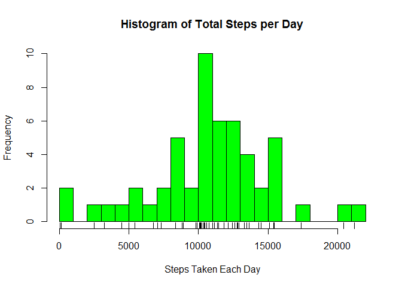
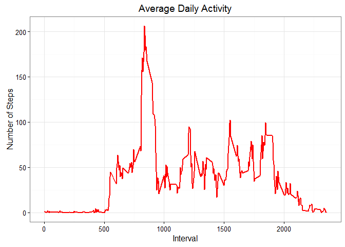
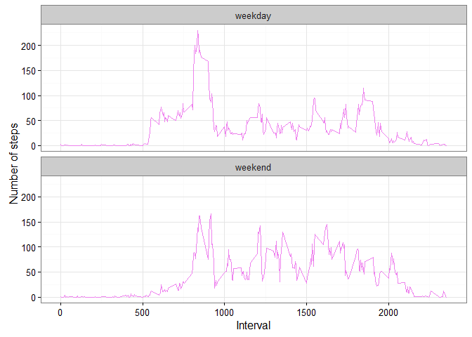

# Reproducible Research: Peer Assessment 1


## Loading and preprocessing the data

```r
library("ggplot2", lib.loc="~/R/win-library/3.1")
 if(!file.exists('activity.csv')){
                unzip('activity.zip')
        }
activity <- read.csv('activity.csv')

activity_no_na<-activity[complete.cases(activity),]
```


## What is mean total number of steps taken per day?

```r
totalsteps<-aggregate(steps~date,activity_no_na,sum)
hist(totalsteps$steps,main="Histogram of Total Steps per Day",xlab="Steps Taken Each Day",col="green",breaks=25)
rug(totalsteps$steps)
```



```r
mean(totalsteps$steps)
```

```
## [1] 10766.19
```

```r
median(totalsteps$steps)
```

```
## [1] 10765
```


## What is the average daily activity pattern?

```r
avgstep<-aggregate(steps~interval,activity_no_na,mean)
ggplot(avgstep,aes(x=interval,y=steps))+geom_line(color="red",size=1)+labs(title="Average Daily Activity",x="Interval",y="Number of Steps")+theme_bw()
```



```r
avgstep[avgstep$steps==max(avgstep$steps),]
```

```
##     interval    steps
## 104      835 206.1698
```


## Imputing missing values

```r
nrow(activity[is.na(activity$steps),])
```

```
## [1] 2304
```

```r
na_fill <- function(activity, avgstep) {
        na_index <- which(is.na(activity$steps))
        na_replace <- unlist(lapply(na_index, FUN=function(idx){
                interval = activity[idx,]$interval
                avgstep[avgstep$interval == interval,]$steps
        }))
        fill_steps <- activity$steps
        fill_steps[na_index] <- na_replace
        fill_steps
}

activity_new <- data.frame(  
        steps = na_fill(activity, avgstep),  
        date = activity$date,  
        interval = activity$interval)
str(activity_new)
```

```
## 'data.frame':	17568 obs. of  3 variables:
##  $ steps   : num  1.717 0.3396 0.1321 0.1509 0.0755 ...
##  $ date    : Factor w/ 61 levels "2012-10-01","2012-10-02",..: 1 1 1 1 1 1 1 1 1 1 ...
##  $ interval: int  0 5 10 15 20 25 30 35 40 45 ...
```

```r
sum(is.na(activity_new$steps))
```

```
## [1] 0
```


## Are there differences in activity patterns between weekdays and weekends?


```r
a1 <- activity_new
weekend <- weekdays(as.Date(activity_new$date)) %in% c("Saturday", "Sunday")
a1$daytype <- "weekday"
a1$daytype[weekend == TRUE] <- "weekend"
a1$daytype <- as.factor(a1$daytype)
stepsa1<-aggregate(steps~interval+daytype,a1,mean)
ggplot(stepsa1, aes(x=interval, y=steps)) + 
        geom_line(color="violet") + 
        facet_wrap(~ daytype, nrow=2, ncol=1) +
        labs(x="Interval", y="Number of steps") +
        theme_bw()
```



